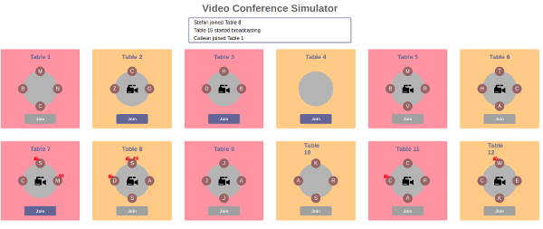

# Video Conference Simulator

 

## How to start it

In terminal type `npm run start` or `node server`

In the browser connect to localhost:3000


## What it does

A Node backed randomly generates the below events and sends them to the frontend via socketing:
- a user joins
- a user leaves
- a broadcast starts at a table
- a broadcast ends at a table
- a user has a webcam issue
- a user has a conection issue
- a user solved a connection issue
- a user solved a webcam issue

The frontend has two sections, a window to show text notifications, and six tables.

It has been assumed that each table can take a maximum of four participants.

The frontend subscribes to socket events and responds to them by:
- including the notification as text in the notifications window
- visually represents what is going on. For example, if a user joins, he/she is seated at the respective table.

## Technologies Used

Backend: Node, Express, socket.io
Frontend: React, Redux, Emotion, socket.io

## Some Interesting Parts

### mock-activity.js

Functions that similate a boradcasting session are selected at random at a specific interval.

```
const actions = [
  data => userJoins(data),
  data => userLeaves(data),
  data => broadcastStarts(data),
  data => broadcastEnds(data),
  data => userHasConnectionIssue(data),
  data => userHasWebcamIssue(data),
  data => userSolvedConnectionIssue(data),
  data => userSolvedWebcamIssue(data),
]
```

Each function does simulates something, again using randomness, and returns the 'state' and a new notification.


### components/tables/tables.js

The frontend subscribes to the 'mocked-activity' socket event and dispatches actions to the state:

```
componentDidMount() {
  this.props.socket.on('mocked-activity', data => {
    this.props.onUpdateTables(data.tables)
    this.props.onUpdateNotifications(data.notifications)
  })
}
```


### redux-components/reducers.js

A reducer manages state by consuming actions and updating state:

```
export const rootReducer = (state = initialState, action) => {
    switch (action.type) {

      case UPDATE_TABLES:
        return { ...state, tables: action.payload }

      case UPDATE_NOTIFICATIONS:
        return { ...state, notifications: action.payload }

      case JOIN_TABLE:
        return { ...state, joinedTable: action.payload }

      default:
        return state
    }
  }
  ```


### components/tables/participant.js

The position of each participant is dynamically calculated.

Each participant's CSS can take `props` and act conditionally based on these props, such as whether to show the red webcam image signifying that the participant has webcam issues:

```
background-image: ${props => props.hasWebcamIssue ? "url('./components/tables/camera-red.png')" : 'none'};
```
